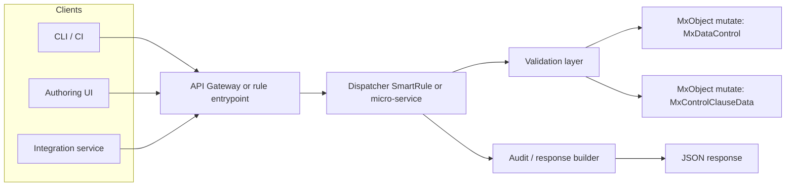
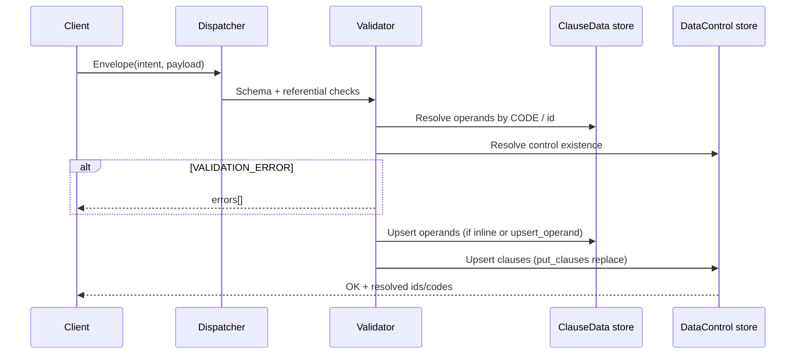

# NewDQC SPEC — Data Control management API (JSON intents)

**Owner**: NeoXam DataHub · DQC (NewDQC workspace)  
**Version**: 0.1  
**Date**: 2026-05-08  
**Status**: Draft (initial carve-out)

## Overview

Define a programmatic interface to **create, update, and delete** DataHub **data quality controls** (`MxDataControl`) and related **comparison clauses**, **clause operands** (`MxControlClauseData`), and optionally **localized names**, by consuming **structured JSON messages** instead of—or alongside—**migration `.pack`** imports.

Motivation:

- Faster iteration cycles (CI, tooling, guarded UI) without repackaging and release-code collisions discussed in **`datahub-pack-installation`**.
- Explicit **validation** and **error responses** for authors (operand reuse, incompatible operators, malformed **`DATA_VALUE`**, merge-key mismatches).

This spec narrows primarily to **`MxYieldCurveValu` / curve valuation CV** shapes already modeled under **`datahub-dqc-datacontrol`** and **`Implementation/Installed/`**, but outlines extension to other applicability classes.

## Goals

1. Accept **JSON request envelopes** describing high-level intents: create control, update control metadata, add/replace/remove clause rows, CRUD operands referenced by clauses, deactivate or delete controls.
2. Map intents to **authoritative persisted objects** aligned with **`MxClassDef`**/`MxControlClauseData`/control clause tables (**no silent partial applies** versus documented merge rules).
3. Return **deterministic outcomes**: success with resolved **object identifiers** (`LOCAL_ID`/internal id), **`CODE`s**, or **structured validation/runtime errors**.
4. Remain compatible with **`get_object_package`**/conformance snapshots for regression (optional export after apply).
5. Support **auditability**: correlation id, actor, snapshot of intent, and timestamps.

## Non-Goals (v0.x)

| Area | Deferred |
|------|----------|
| **`MxRule`** / **`DATACONTROL_TYPE`** authoring inside this API | Separate spec or prerequisite packages/rules |
| **Execution rules**, screening, **`MxControlExecResult`** semantics | Consume existing DQC screening only |
| **Multi-tenant** Hub routing | Single configured Hub endpoint |
| **Full parity** with every Migration merger edge case in one release | Phase 1 narrows curve CV + unary/binary patterns already exercised |
| **UI replacement** | API complements Factory; optionally drives a thin authoring UI |

## Related documentation

| Resource | Purpose |
|---------|---------|
| `Skills/agent-skills/datahub-dqc-datacontrol/SKILL.md` | Operand reuse, unary **`NULL`**, **`GREATER`**, **`DATA_VALUE`**, **`LOCAL_ID`**, package bump rules |
| `Skills/agent-skills/datahub-pack-installation/SKILL.md` | Same-`PACKAGE` reinstall limitations |
| `Knowledge/Reference/NeoXam DataHub - Data Quality Control New Design.pdf` | Product semantics (screens, PASS/FAIL wording) |

## Architecture (conceptual)



**Implementation options** (pick one primary in a later amendment):

| Option | Pros | Cons |
|--------|------|------|
| **A.** Single **SmartRule** (`DQC_CTL_API_DISPATCH`) invoked with JSON string payload | Runs in Hub JVM, natural object APIs | Operational limits, versioning, timeouts |
| **B.** External service + Hub **REST/smart service** primitives | Clear deployment boundary | Credential model, transactional boundaries |
| **C.** Hybrid: external validates + generates **narrow delta packs** | Reuses Migration merge | Keeps `.pack`; not pure JSON-to-DB |

This spec prefers **explicit choice in v0.2** after a spike; **draft JSON contract** stays transport-agnostic.

## Core domain bindings (constraints the API MUST enforce)

1. **`MxControlClauseData` uniqueness per control**: a given **`CODE`** operand must appear **at most once** as assessed **or** target across all clause rows of one **`MxDataControl`** (**operand reuse prohibition** — see **`datahub-dqc-datacontrol`**).

2. **Clause merge keys**: Hub often persists **`T_DATACONTROL_CLAUSES`** with **`CODEFIELDS`** including **`ASSESSED_DATA^CLAUSE_OPERATOR^TARGET_DATA`**. Adding or changing operator/target/reference must **invalidate or DELETE** conflicting rows deterministically—or return **MERGE_KEY_CONFLICT** if unsafe.

3. **Fixed numeric thresholds**: For **`VALUE_OF`** + **`DATA_SOURCE_TYPE` `VALUE`** + **`DATA_FORMAT` `NUMERICF`**, **`DATA_VALUE`** must be authored in this workspace as **`CDATA`** plain **`10`** (example) unless environment export proves otherwise; **`LABEL`** (**`10%`**) alone is insufficient for execution semantics.

4. **Identity resolution**: Prefer stable **`CODE`** on **`FIND="CODE='…'"`** inputs; **`LOCAL_ID`** must be refreshed from **`get_object_package`** when targeting a specific Hub **or** omitted only if Dispatcher guarantees FIND-only merge (risk: document).

5. **Delete semantics**: **`delete_control`** may **soft-delete** (`ACTIVE=N`) vs **hard delete** — product default must be validated; cascading clause links tracked per NeoXam product behavior.

## API surface (v0.1 intents)

Unified **request envelope**:

```json
{
  "apiVersion": "0.1",
  "correlationId": "uuid-or-string",
  "actor": {"userId": "lf.guimaraes", "source": "NewDQC-ctl-api"},
  "intent": "create_control | patch_control | put_clauses | patch_clause | delete_clause | upsert_operand | delete_operand | delete_control",
  "payload": {}
}
```

**Response envelope** (conceptual):

```json
{
  "apiVersion": "0.1",
  "correlationId": "…",
  "status": "OK | VALIDATION_ERROR | CONFLICT | NOT_FOUND | INTERNAL_ERROR",
  "data": {},
  "errors": [{ "code": "…", "message": "…", "path": "payload.clauses[2]" }]
}
```

### Intent summaries

| Intent | Purpose |
|--------|---------|
| **`create_control`** | Create **`MxDataControl`** with metadata + optional initial clause definitions (inline or **`$ref`** operands). |
| **`patch_control`** | Update applicability, **`BUSINESS_CLASS`**, **`ACTIVE`**, comments, **`T_DATACONTROL_NAME`**. |
| **`upsert_operand`** | Create or update **`MxControlClauseData`** by **`CODE`** (full row or allowed partial fields listed in schema v0.2). |
| **`delete_operand`** | Delete when **not referenced** by any **`MxDataControl`** cláuse—or return **REFERENCE_CONFLICT**. |
| **`patch_clause`** | Single clause mutation (identified by merge key surrogate `clauseId` or triple + assess/target codes). |
| **`put_clauses`** | Replace **all** clause rows for a control (**idempotent** configuration source of truth)—recommended pattern to avoid orphaned merge triples (see caveat in skill). |
| **`delete_clause`** | Remove one clause row (and unlink). |
| **`delete_control`** | Soft or hard delete per policy flag. |

## Payload sketch ( **`put_clauses`** )

Illustrative only; formal JSON Schema deferred to **v0.2**.

```json
{
  "control": {
    "code": "CONTROL_YC_TENOR_VARIATION",
    "label": "CV - Tenor variation (10% threshold)",
    "active": true,
    "applicability": "BIZDICO",
    "businessClassCode": "YC_CURVE_VALUATION"
  },
  "clauses": [
    {
      "evaluateOrder": 0,
      "label": "Variation Mid 1D > 10%",
      "assessedOperandRef": {"code": "Assessed_YC_VAR_YC_MID_1D_OK"},
      "operator": "GREATER",
      "targetOperandRef": {"code": "Target_YC_VAR_THRESH010_MID_1D"}
    }
  ],
  "options": {"clauseMode": "replace_all", "onOperandMissing": "fail"}
}
```

## Processing logic (high level)



1. Resolve **`businessClassCode`**, **`APPLICABILITY`**, **`DATACONTROL_CLAUSE_OPERATORS`** membership for **`operator`** × assessed **`CONTROL_TYPE`/format compatibility** (narrow table in **v0.2** PDF/skill-aligned).
2. Resolve operand **`CODE`**s; **`onOperandMissing`**: **`fail`** (default) vs **`createMinimal`** (**out of scope** unless operand template registry added).
3. Apply **`MxDataControl`** row + **`T_DATACONTROL_NAME`** if provided.
4. Apply clause rows; for **`replace_all`**, **delete** rows not in payload (order explicit in implementation contract).
5. Commit transaction; build response with **`LOCAL_ID`** map for touched objects.

## Error handling (normative categories)

| Code | When |
|------|------|
| **`VALIDATION_ERROR`** | JSON schema, missing **`CODE`**, unknown list item, operator/type mismatch |
| **`OPERAND_REUSE`** | Same operand **`CODE`** bound twice on one control |
| **`MERGE_KEY_CONFLICT`** | Cannot transition clause without orphaning triple / duplicate **`EVALUATE_ORDER`** |
| **`NOT_FOUND`** | Unknown control or operand **`CODE`** when **`fail`** on missing |
| **`REFERENCE_CONFLICT`** | Operand delete still referenced |
| **`CONCURRENCY`** | Optimistic lock failure (if versions added) |
| **`INTERNAL_ERROR`** | Uncaught server rule exception |

## Performance & operations

- Batch **`put_clauses`** for one control should target **&lt; 2 s** p95 on reference curve controls (8 pillars + metadata); measure under Hub load.
- Rate-limit concurrent **`replace_all`** on same **`control.code`**.
- Log **`correlationId`** in Hub audit trail or side table.

## Testing approach

| Layer | Tests |
|-------|--------|
| **Contract** | JSON Schema examples (golden files) for each intent |
| **Integration** | Apply against disposable Hub → **`get_object_package(MxDataControl, …)`** and operands → diff to expected XML/JSON normal form |
| **Regression** | Compare behaviour to golden **`Implementation/Installed/MxDataControl_CONTROL_YC_TENOR_VARIATION_*.pack`** exports after round-trip |
| **Negative** | Operand reuse, invalid unary with target, wrong **`DATA_VALUE`** scale vs rule output |

## Deployment & migration path

1. **Phase 0**: Document-only (this spec) + spike (Option A vs B).
2. **Phase 1**: Read-only **`GET control + clauses + operands`** as JSON (no mutation) to validate resolution.
3. **`put_clauses` + `upsert_operand`** for **curve variation** only.
4. Extend to **unary completeness** controls; then **identification** controls.
5. Optional: **emit equivalent `.pack`** from successful apply for Git archive (hybrid).

## Open questions

1. **Transactional boundary**: single SmartRule transaction vs multi-call compensation.
2. **Authority model**: who may delete operands shared across controls (if ever allowed).
3. **`DATA_VALUE` canonicalization** per Hub build (plain **`10`** vs typed export) — **lock to `get_object_package`** post-manual baseline.
4. **Version field** on control for optimistic concurrency.

## Changelog

| Version | Date | Notes |
|---------|------|------|
| 0.1 | 2026-05-08 | Initial draft: goals, intents, constraints, diagrams |
