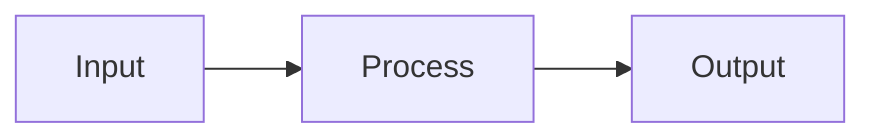

# {ProjectName}_SPEC_Example

> **Naming**: Replace `{ProjectName}` with `workspace.projectName` from `.datahub-workspace.json`. Example: `MyProject_SPEC_Example.md`

**Owner**: [Your Name]  
**Version**: 1.0  
**Date**: YYYY-MM-DD

## Overview

Brief description of the feature or change.

## Goals

- Primary goal 1
- Primary goal 2

## Non-Goals

- Out of scope for this specification

## Inputs

| Input | Type | Description |
|-------|------|-------------|
| arg1 | string | Input description |
| arg2 | string | Input description |

## Processing Logic

1. Step 1
2. Step 2
3. Step 3

## Outputs

| Output | Type | Description |
|--------|------|-------------|
| result | string | Output description |

## Error Handling

- Error case 1: handling behavior
- Error case 2: handling behavior

## Schema (Mermaid)

## Testing Approach

- Unit test scenarios
- Integration test scenarios

## Deployment Packages

- `Implementation/Example_Package.pack`
